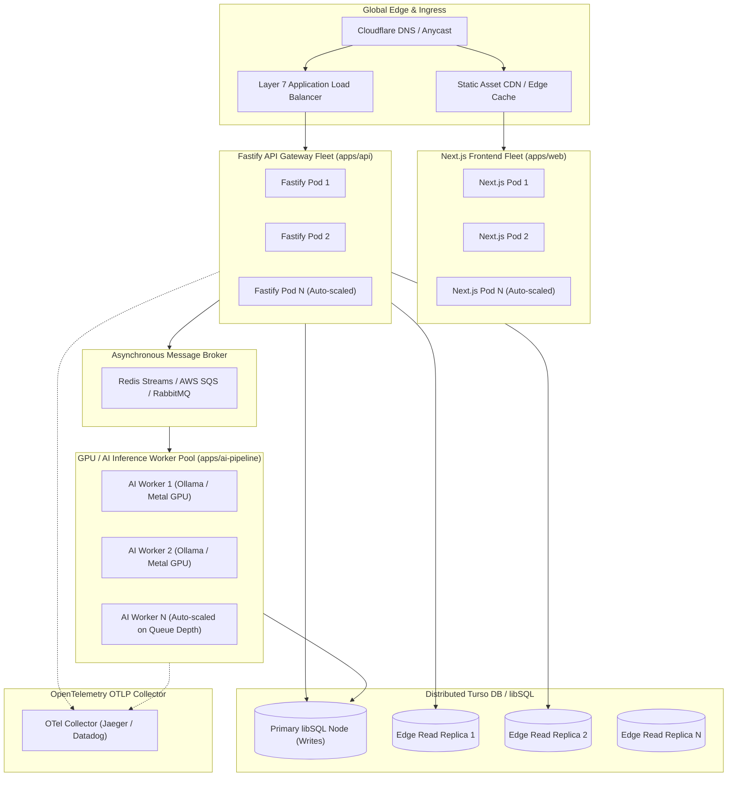

# Horizontal Scalability Architecture — ai-job-matching-engine

**Document**: Horizontal Scaling Guide & Distributed Topology  
**Location**: `/Users/chung/sandbox/matcha.fm/full-stack-engineer/ai-job-matching-engine/HORIZONTAL_SCALING.md`  
**Date**: September 25, 2026  

---

## 1. Monorepo vs. Monolith: Decoupling Code Organization from Deployment

A foundational architectural distinction in `ai-job-matching-engine`:
- **Monorepo (Code Organization)**: Shared TypeScript types, unified Drizzle schemas, single CI pipeline, and atomic versioning across `apps/` and `packages/`.
- **Microservice / Distributed Architecture (Runtime Topology)**: Independently packaged, stateless containers with independent auto-scaling triggers, separate compute resources, and decoupled lifecycle boundaries.

---

## 2. Horizontal Scaling Topology Diagram



---

## 3. Layer-by-Layer Horizontal Scaling Breakdown

### 3.1 Fastify Backend API (`apps/api`)
- **State Character**: **100% Stateless**.
- **Session / Auth**: Token-based (JWT or bearer keys); no sticky sessions or in-process session stores.
- **Scaling Mechanism**:
  - Horizontal Pod Autoscaler (HPA) targeting CPU utilization $> 70\%$ or request latency $> 50\text{ms}$.
  - Scale from 2 replicas (low traffic) to 50+ replicas during peak recruitment cycles.
- **Connection Pooling**: libSQL client manages connection pooling per process with HTTP/WebSocket transport to Turso DB.
- **OpenTelemetry Continuity**: W3C `traceparent` headers propagate incoming trace context across instances to preserve end-to-end distributed span graphs.

### 3.2 AI & Data Ingestion Pipeline (`apps/ai-pipeline`)
- **Compute Character**: Heavy matrix math, LLM token generation, vector embeddings.
- **Decoupling Strategy**:
  - The API does not run synchronous Python subprocesses in production; it pushes batch ingestion jobs to an asynchronous message queue (Redis Streams, Celery, or AWS SQS).
  - Workers pull jobs off the queue independently.
- **Auto-Scaling Metric**:
  - Workers scale on **Queue Depth / Ingestion Lag** rather than CPU utilization:
    $$\text{Scale Target} = \max\left(1, \left\lceil \frac{\text{Queue Length}}{\text{Throughput per Worker}} \right\rceil\right)$$
- **Hardware Optimization**:
  - Workers can run on GPU instances (NVIDIA TensorRT-LLM, AWS g5.xlarge, or dedicated Apple Silicon clusters running Ollama Metal acceleration).

### 3.3 Database Layer: Turso DB (libSQL) Distributed Replicas
- **The SQLite Misconception**: Traditional SQLite is single-file and node-locked. **Turso DB / libSQL** is distributed:
  - **Single Primary Node**: Handles atomic `INSERT`, `UPDATE`, and schema migrations (`drizzle-kit`).
  - **Embedded / Edge Read Replicas**: Synchronize write-ahead logs (WAL) asynchronously with sub-5ms replication lag.
  - **Zero Read Bottleneck**: Candidate match lookups and job queries read exclusively from local in-memory replicas located geographically closest to the API instance.
  - **In-Process Recursive CTEs**: Skill ontology queries execute inside the local SQLite C-engine in $< 0.5\text{ms}$ without traversing the public network to a central graph database.

### 3.4 Next.js Frontend (`apps/web`)
- **State Character**: Client-side state managed via **Jotai**; server state cached via **TanStack Query v5**.
- **Edge Deployment**:
  - Static assets and ISR pages deployed across global edge networks (Cloudflare Pages, Vercel Edge Network, or AWS CloudFront).
  - Next.js SSR containers run on Kubernetes or AWS ECS behind Cloudflare load balancers.

---

## 4. Throughput & Scaling Formulation

Using Python notation for system throughput:

```python
# System Throughput Formulation
def calculate_system_capacity(n_api_pods, n_ai_workers, n_db_replicas):
    # Fastify API capacity (I/O bound)
    rps_per_pod = 12000  # typical Fastify HTTP benchmark throughput
    total_api_capacity_rps = n_api_pods * rps_per_pod

    # AI Ingestion capacity (compute bound)
    jobs_per_sec_per_worker = 2.5  # LLM extraction (llama3.2:3b) + vector generation
    total_ingestion_capacity_jps = n_ai_workers * jobs_per_sec_per_worker

    # Turso Read capacity (replicated)
    reads_per_sec_per_replica = 45000  # SQLite in-memory read throughput
    total_db_read_capacity_rps = n_db_replicas * reads_per_sec_per_replica

    return {
        "max_concurrent_api_rps": total_api_capacity_rps,
        "max_ingestion_jobs_per_sec": total_ingestion_capacity_jps,
        "max_candidate_query_rps": total_db_read_capacity_rps
    }
```

---

## 5. Summary of Horizontal Scalability Guarantees

1. **Independent Lifecycle**: Scaling the AI batch extraction pool from 1 to 20 nodes has zero impact on API latency or frontend availability.
2. **Stateless Gateway**: Fastify replicas can be spun up or terminated instantly with zero session loss.
3. **Database Read Replicability**: Turso DB allows horizontal scaling of search and matching queries without write contention.
4. **Monorepo Advantage**: Code sharing (`@job-engine/db`) ensures strict type safety across all distributed services without duplicating schema definitions or maintenance overhead.
