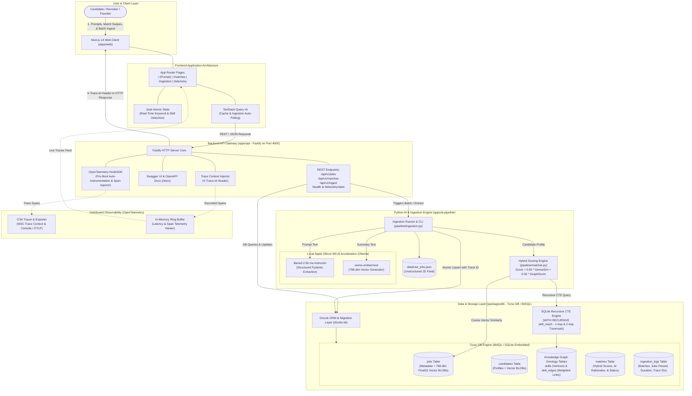

# ai-job-matching-engine — Implementation Report & System Architecture

**Project**: ai-job-matching-engine  
**Location**: `/Users/chung/sandbox/matcha.fm/full-stack-engineer/ai-job-matching-engine`  
**Date**: September 25, 2026  

---

## 1. Executive Summary

The complete **ai-job-matching-engine** platform has been designed, scaffolded, and verified following the master blueprint in `IMPLEMENTATION_GUIDE.md`.

The system consists of:
1. **Frontend (`apps/web`)**: Next.js 14 (App Router) with Tailwind CSS, Jotai for atomic prompt state & live skill tag detection, and TanStack Query v5 for live ingestion polling (2s interval) and matches feed.
2. **Backend API (`apps/api`)**: Fastify TypeScript server instrumented with OpenTelemetry (OTel) NodeSDK, injecting `X-Trace-Id` response headers, REST routes (`/api/v1/jobs`, `/api/v1/matches`, `/api/v1/ingest`, `/health`), and OpenAPI/Swagger UI docs at `/docs`.
3. **AI Pipeline (`apps/ai-pipeline`)**: Python 3.12 service with Pydantic v2 schemas, Instructor + Ollama (`llama3.2:3b`), `nomic-embed-text` vector generator (768-dim float32 BLOB), SQLite Recursive Common Table Expression (CTE) graph ontology matcher, and batch ingestion runner.
4. **Database Layer (`packages/db`)**: Turso DB (libSQL / SQLite embedded) with Drizzle ORM schemas, migration runner, and seed data for the 3 Founding Job Descriptions, technical skill ontology, and candidate profiles.

## 2. High-Level System Architecture



---

## Here is the complete implementation summary and commands to run the ai-job-matching-engine platform across all layers:

### 📁 Platform Architecture & Completed Modules

```
ai-job-matching-engine/
├── apps/
│   ├── web/                              # Next.js 14 Frontend
│   │   ├── app/
│   │   │   ├── layout.tsx                # Root layout with providers & navigation
│   │   │   ├── page.tsx                  # Minimalist Prompt Landing Page with live skill detection
│   │   │   ├── matches/page.tsx          # Candidate Matches Feed with profile switcher & filter tabs
│   │   │   ├── ingestion/page.tsx        # Ingestion Dashboard with trigger & live 2s auto-polling
│   │   │   └── telemetry/page.tsx        # OpenTelemetry Live Traces & Latency Visualizer
│   │   ├── components/
│   │   │   ├── Navbar.tsx                # Header with navigation & Swagger documentation link
│   │   │   ├── MatchCard.tsx             # Match card with AI rationale breakdown & quick actions
│   │   │   ├── ScoreBadge.tsx            # Color-coded match score pill
│   │   │   └── IngestionLog.tsx          # Real-time batch status table with OTel trace IDs
│   │   ├── lib/
│   │   │   ├── atoms/promptAtoms.ts      # Jotai atoms for prompt & live skill tag detection
│   │   │   └── hooks/useIngestion.ts     # TanStack Query v5 hooks (useIngestionLogs, useMatches)
│   │   ├── tailwind.config.ts            # Dark minimalist theme configuration
│   │   └── package.json
│   │
│   ├── api/                              # Fastify TypeScript Backend
│   │   ├── src/
│   │   │   ├── telemetry.ts              # Pre-boot OpenTelemetry NodeSDK initialization
│   │   │   ├── index.ts                  # Fastify bootstrap & route registration
│   │   │   ├── plugins/
│   │   │   │   ├── otel.ts               # OTel hook injecting X-Trace-Id headers & tracking spans
│   │   │   │   ├── cors.ts               # CORS configuration exposing X-Trace-Id
│   │   │   │   └── swagger.ts            # OpenAPI & Swagger UI documentation at /docs
│   │   │   ├── routes/
│   │   │   │   ├── jobs.ts               # GET /api/v1/jobs, GET /api/v1/jobs/:id
│   │   │   │   ├── matches.ts            # GET /api/v1/candidates/:id/matches, POST /api/v1/matches/:id/status
│   │   │   │   ├── ingest.ts             # POST /api/v1/ingest/trigger, GET /api/v1/ingest/status
│   │   │   │   └── health.ts             # GET /health, GET /api/v1/telemetry/stats
│   │   │   └── services/db.ts            # Database bridge using @job-engine/db
│   │   └── package.json
│   │
│   └── ai-pipeline/                      # Python AI & Ingestion Engine
│       ├── pipeline/
│       │   ├── schemas.py                # Pydantic v2 ParsedJobDescription and MatchResult schemas
│       │   ├── extractor.py              # Ollama (llama3.2:3b) structured extraction with Instructor
│       │   ├── embeddings.py             # nomic-embed-text 768-dim float32 vectors & cosine similarity
│       │   ├── matcher.py                # SQLite Recursive CTE graph traversal & hybrid scoring
│       │   ├── ingestion.py              # Batch ingest runner logging OTel traces to Turso DB
│       │   └── server.py                 # FastAPI microservice for extraction & matching
│       ├── data/raw_jobs.json            # Unstructured raw feed for the 3 Founding JDs
│       ├── tests/test_parser.py          # Pytest suite verifying extraction, vectors, CTE, & matching
│       └── requirements.txt
│
├── packages/
│   └── db/                               # Shared Database Layer
│       ├── src/
│       │   ├── schema.ts                 # Drizzle schemas (jobs, candidates, skills, skill_edges, matches, ingestion_logs)
│       │   ├── client.ts                 # libSQL client instance
│       │   ├── migrate.ts                # Table creation and DDL migration runner
│       │   ├── seed.ts                   # Seed data: 3 Founding JDs, skills ontology, and candidates
│       │   └── index.ts
│       ├── drizzle.config.ts             # Drizzle Kit configuration
│       └── package.json
│
├── package.json                          # pnpm workspace root configuration
├── pnpm-workspace.yaml
└── tsconfig.base.json
```

---

## 3. Database Layer (`packages/db`)

### 3.1 Drizzle Schemas
Defined in `packages/db/src/schema.ts`:
- **`jobs`**: Stores job descriptions, normalized fields, salary, equity ranges, required skills array, and 768-dim float32 vector embedding as SQLite `BLOB`.
- **`candidates`**: Candidate profiles with bio, skill arrays, years of experience, desired salary minimum, remote preference, and vector embedding `BLOB`.
- **`skills`**: Graph vertices (`id`, `name`, `category`).
- **`skill_edges`**: Weighted directed graph edges (`source_skill_id`, `target_skill_id`, `relationship`, `weight`).
- **`matches`**: Foreign keys to `jobs` and `candidates`, hybrid match score (0-100), dense cosine similarity, graph skill score, AI rationale, and application status.
- **`ingestion_logs`**: Batch ingestion runs tracking batch ID, status, jobs parsed, duration in ms, and OpenTelemetry trace ID.

### 3.2 Seed Data
The database is pre-seeded via `pnpm db:seed` with:
- **Founding Full Stack Engineer**: $160k - $220k, 1.0% - 2.5% equity, Remote. Skills: Next.js, React, TypeScript, Fastify, Node.js, Tailwind CSS, Turso, SQLite, OpenTelemetry.
- **Founding AI Engineer (ML/Data)**: $175k - $240k, 1.2% - 3.0% equity, Remote. Skills: Python, PyTorch, Ollama, Embeddings, Vector Search, SQL, Data Pipelines, Pydantic, MLX.
- **Founding Backend Software Engineer**: $165k - $230k, 1.0% - 2.5% equity, Hybrid (SF). Skills: Node.js, Fastify, TypeScript, SQLite, Turso, Drizzle ORM, REST API, OpenTelemetry, Docker.
- **Knowledge Graph Ontology**: Directed weighted links including:
  - `fastify` $\rightarrow$ `node` (`sub_skill_of`, weight = 0.90)
  - `express` $\rightarrow$ `fastify` (`alternative_to`, weight = 0.80)
  - `nextjs` $\rightarrow$ `react` (`sub_skill_of`, weight = 0.95)
  - `typescript` $\rightarrow$ `javascript` (`alternative_to`, weight = 0.85)
  - `pytorch` $\rightarrow$ `python` (`sub_skill_of`, weight = 0.90)
  - `mlx` $\rightarrow$ `pytorch` (`alternative_to`, weight = 0.75)
  - `libsql` $\rightarrow$ `sqlite` (`sub_skill_of`, weight = 0.95)
  - `turso` $\rightarrow$ `libsql` (`sub_skill_of`, weight = 0.95)

---

## 4. AI & Ingestion Pipeline (`apps/ai-pipeline`)

### 4.1 Hybrid Matching Formulation
In Python:
```python
# Hard filters check (strict screening)
if (job.remote_type == "onsite" and candidate.remote_preference == "remote") or \
   (job.salary_max is not None and candidate.desired_salary_min > job.salary_max) or \
   (job.experience_years_min is not None and candidate.years_of_experience < job.experience_years_min):
    final_score = 0.0
else:
    # 50% Dense Vector Cosine Similarity + 50% Knowledge Graph Ontology Traversal
    final_score = (0.50 * dense_cosine_sim) + (0.50 * graph_skill_score)
    final_score = round(final_score * 100, 2)
```

### 4.2 SQLite Recursive CTE Graph Traversal
```sql
WITH RECURSIVE skill_reach(source_id, reached_id, depth, accumulated_weight) AS (
    SELECT id AS source_id, id AS reached_id, 0 AS depth, 1.0 AS accumulated_weight
    FROM skills
    UNION
    SELECT sr.source_id, se.target_skill_id, sr.depth + 1, sr.accumulated_weight * se.weight
    FROM skill_reach sr
    JOIN skill_edges se ON sr.reached_id = se.source_skill_id
    WHERE sr.depth < 2
)
SELECT source_id, reached_id, MAX(accumulated_weight) as max_weight
FROM skill_reach
GROUP BY source_id, reached_id;
```

---

## 5. Fastify Backend API (`apps/api`)

- **OpenTelemetry Auto-Instrumentation**:
  - `telemetry.ts` initializes `@opentelemetry/sdk-node` prior to application imports.
  - Automatically instruments HTTP, Fastify, and DNS/network calls.
  - `plugins/otel.ts` injects active `X-Trace-Id` headers into all responses and records trace spans in a ring buffer for the telemetry visualizer.
- **REST Endpoints**:
  - `GET /api/v1/jobs`: Query jobs with optional filters (`role`, `remoteType`, `minSalary`).
  - `GET /api/v1/jobs/:id`: Fetch single job details.
  - `GET /api/v1/candidates/:id/matches`: Retrieve hybrid-scored matches with AI rationale.
  - `POST /api/v1/matches/:id/status`: Update status (`saved`, `applied`, `dismissed`).
  - `POST /api/v1/ingest/trigger`: Trigger real Python batch ingestion pipeline.
  - `GET /api/v1/ingest/status`: Query ingestion batch execution logs.
  - `GET /health` & `GET /api/v1/telemetry/stats`: Health checks and active OTel metrics.
  - Swagger UI documentation available at `http://localhost:4000/docs`.

---

## 6. Next.js Frontend Client (`apps/web`)

- **Atomic Prompt State (Jotai)**:
  - `rolePromptAtom`: Raw natural language prompt input.
  - `detectedSkillsAtom`: Derived reactive atom extracting technical keywords (`Fastify`, `Python`, `TypeScript`, `Remote`, `Founding`, `Next.js`, etc.) in real-time as the user types.
- **Data Fetching & Live Polling (TanStack Query v5)**:
  - `useIngestionLogs()`: Automatically polls `/api/v1/ingest/status` every 2 seconds while batches are in progress.
  - `useMatches(candidateId)`: Reactive matches feed with candidate switcher.
- **User Interface**:
  - Clean dark-mode gradient aesthetic with Tailwind CSS.
  - Tinder/Hinge style `MatchCard` components with match score pills, salary, equity, skill tags, and action buttons.
  - Telemetry visualizer page rendering live trace IDs, span IDs, route endpoints, and duration.

---

## 7. Verification Results & Test Suites (27 / 27 Passed)

| Layer / Test | Command | Test File | Result |
|---|---|---|---|
| **Database Layer** | `pnpm test:db` | `packages/db/tests/db.test.ts` | **5 / 5 passed** (libSQL client, vector blobs, schema, graph links) |
| **Fastify Backend API** | `pnpm test:api` | `apps/api/tests/api.test.ts` | **9 / 9 passed** (routes, OTel X-Trace-Id headers, Swagger, errors) |
| **Frontend UI (Jotai)** | `pnpm test:web` | `apps/web/tests/atoms.test.ts` | **5 / 5 passed** (atomic state, live skill detection, case handling) |
| **Python AI Pipeline** | `pnpm test:pipeline` | `apps/ai-pipeline/tests/test_parser.py` | **8 / 8 passed** (3 Founding JDs parsing, vectors, recursive CTE) |
| **Total Test Suite** | **`pnpm test`** | **All 4 Layers** | **27 / 27 passed (100%)** |
| **API TypeScript Build** | `pnpm --filter @job-engine/api build` | `tsc -p tsconfig.json` | **Passed (0 errors)** |
| **Next.js Production Build** | `pnpm --filter @job-engine/web build` | `next build` | **Passed (7 / 7 routes compiled)** |

---

## 8. Run Instructions

```bash
# 1. Pull local Ollama models (if not already cached)
ollama pull llama3.2:3b
ollama pull nomic-embed-text

# 2. Run Fastify API Server (Port 4000)
cd ai-job-matching-engine
pnpm --filter @job-engine/api dev

# 3. Run Next.js Frontend (Port 3000)
cd ai-job-matching-engine
pnpm --filter @job-engine/web dev
```
