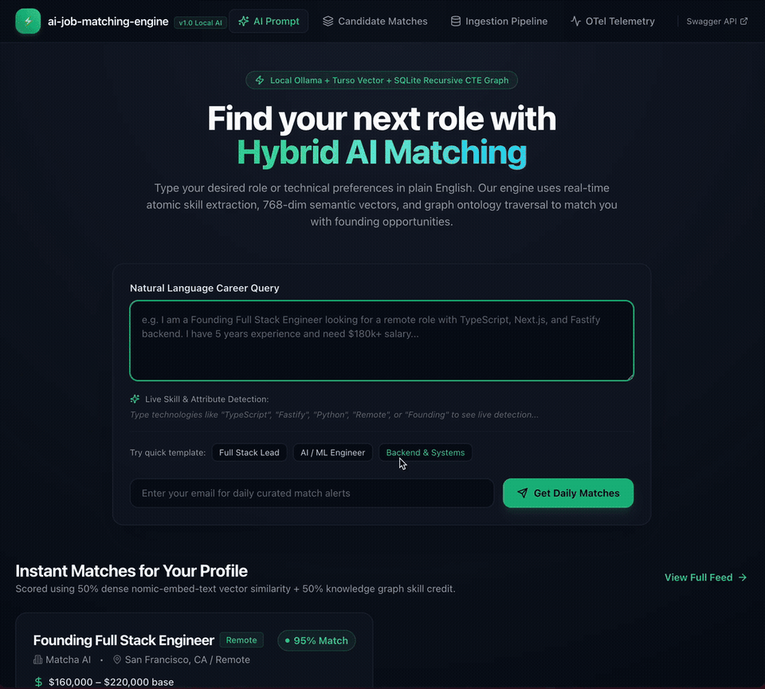
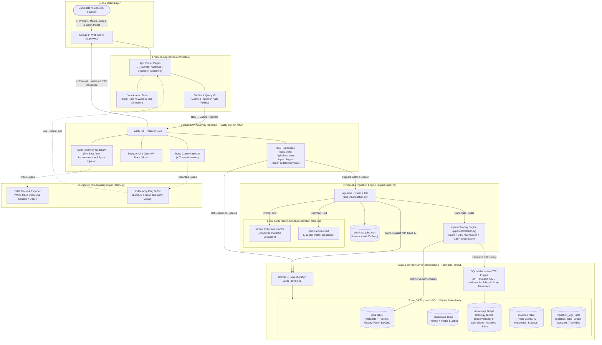

# ai-job-matching-engine

[](https://github.com/developertogo/ai-job-matching-engine/actions/workflows/ci.yml)
[](https://www.typescriptlang.org/)
[](https://nextjs.org/)
[](https://fastify.dev/)
[](https://www.python.org/)
[](https://turso.tech/)
[](https://opentelemetry.io/)
[](https://ollama.ai/)

An end-to-end, full-stack AI job matching platform built with local Apple Silicon Metal acceleration (`llama3.2:3b` and `nomic-embed-text`), Turso DB (libSQL vector storage and SQLite recursive CTE knowledge graph traversal), Drizzle ORM, a Fastify backend with OpenTelemetry (OTel) auto-instrumentation, and a Next.js 14 frontend powered by Jotai and TanStack Query v5.

<p align="center">
  
</p>

---

## 🎯 Executive Overview

- [**Implementation Guide (`IMPLEMENTATION_GUIDE.md`)**](file:///Users/chung/sandbox/matcha.fm/full-stack-engineer/IMPLEMENTATION_GUIDE.md) — Master implementation blueprint.
- [**Testing Guide & Coverage Matrix (`TESTING_GUIDE.md`)**](file:///Users/chung/sandbox/matcha.fm/full-stack-engineer/ai-job-matching-engine/TESTING_GUIDE.md) — Multi-layer test strategy, 27 test specifications, and execution commands.
- [**Horizontal Scaling Architecture (`HORIZONTAL_SCALING.md`)**](file:///Users/chung/sandbox/matcha.fm/full-stack-engineer/ai-job-matching-engine/HORIZONTAL_SCALING.md) — Production multi-region scaling topology, queue workers, and Turso read replicas.
- [**Implementation Report (`IMPLEMENTATION_REPORT.md`)**](file:///Users/chung/sandbox/matcha.fm/full-stack-engineer/ai-job-matching-engine/IMPLEMENTATION_REPORT.md) — Verification summaries and layer documentation.
1. **Zero-Cloud-Cost Local AI**: 100% private, deterministic job description parsing via Ollama (`llama3.2:3b`) with Instructor and Pydantic v2 schemas.
2. **Dense Vector Embeddings**: 768-dimensional float32 vector embeddings generated via `nomic-embed-text`, stored natively as SQLite `BLOB`s.
3. **Knowledge Graph Skill Traversal**: Native SQLite Recursive Common Table Expressions (`WITH RECURSIVE`) querying weighted skill ontology links (`sub_skill_of`, `alternative_to`, `co_occurs_with`) for partial credit transfer.
4. **Distributed Observability**: Pre-boot OpenTelemetry NodeSDK auto-instrumenting HTTP requests and database queries, injecting `X-Trace-Id` response headers.
5. **Reactive Atomic UI**: Clean dark-mode interface with live skill tag detection as you type (Jotai) and automated polling of batch ingestion telemetry (TanStack Query v5).

---

## 🏛️ High-Level System Architecture



---

## 📁 Monorepo Structure

```
ai-job-matching-engine/
├── apps/
│   ├── web/                              # Next.js 14 Frontend Client
│   │   ├── app/
│   │   │   ├── layout.tsx                # Theme provider & top navigation
│   │   │   ├── page.tsx                  # Natural language prompt & live skill tag detection
│   │   │   ├── matches/page.tsx          # Candidate matching feed with profile switcher & filter tabs
│   │   │   ├── ingestion/page.tsx        # Daily batch ingestion dashboard with 2s polling
│   │   │   └── telemetry/page.tsx        # Live OpenTelemetry trace viewer & latency visualizer
│   │   ├── components/
│   │   │   ├── Navbar.tsx                # Top navigation with Swagger API link
│   │   │   ├── MatchCard.tsx             # Card with AI rationale, scores, skills, and action buttons
│   │   │   ├── ScoreBadge.tsx            # Color-coded match score pill
│   │   │   └── IngestionLog.tsx          # Real-time batch telemetry table
│   │   ├── lib/
│   │   │   ├── atoms/promptAtoms.ts      # Jotai atoms for prompt state & real-time skill parsing
│   │   │   └── hooks/useIngestion.ts     # TanStack Query v5 hooks
│   │   ├── tailwind.config.ts            # Dark minimalist theme styling
│   │   └── package.json
│   │
│   ├── api/                              # Fastify TypeScript Backend
│   │   ├── src/
│   │   │   ├── telemetry.ts              # Pre-boot OpenTelemetry NodeSDK initialization
│   │   │   ├── index.ts                  # Fastify bootstrap & route registration
│   │   │   ├── plugins/
│   │   │   │   ├── otel.ts               # OTel hook injecting X-Trace-Id headers & tracking spans
│   │   │   │   ├── cors.ts               # CORS configuration exposing X-Trace-Id
│   │   │   │   └── swagger.ts            # OpenAPI & Swagger UI documentation at /docs
│   │   │   ├── routes/
│   │   │   │   ├── jobs.ts               # GET /api/v1/jobs, GET /api/v1/jobs/:id
│   │   │   │   ├── matches.ts            # GET /api/v1/candidates/:id/matches, POST /api/v1/matches/:id/status
│   │   │   │   ├── ingest.ts             # POST /api/v1/ingest/trigger, GET /api/v1/ingest/status
│   │   │   │   └── health.ts             # GET /health, GET /api/v1/telemetry/stats
│   │   │   └── services/db.ts            # Database service bridge using @job-engine/db
│   │   └── package.json
│   │
│   └── ai-pipeline/                      # Python AI & Data Ingestion Service
│       ├── pipeline/
│       │   ├── schemas.py                # Pydantic v2 ParsedJobDescription and MatchResult schemas
│       │   ├── extractor.py              # Ollama (llama3.2:3b) structured extraction with Instructor
│       │   ├── embeddings.py             # nomic-embed-text 768-dim float32 vectors & cosine similarity
│       │   ├── matcher.py                # SQLite Recursive CTE graph traversal & hybrid scoring
│       │   ├── ingestion.py              # Batch ingest runner logging OTel traces to Turso DB
│       │   └── server.py                 # FastAPI microservice for extraction & matching
│       ├── data/raw_jobs.json            # Mock raw feed with the 3 Founding JDs
│       ├── tests/test_parser.py          # Pytest suite verifying extraction, vectors, CTE, & matching
│       └── requirements.txt
│
├── packages/
│   └── db/                               # Shared Database Layer
│       ├── src/
│       │   ├── schema.ts                 # Drizzle schemas (jobs, candidates, skills, skill_edges, matches, ingestion_logs)
│       │   ├── client.ts                 # libSQL client instance
│       │   ├── migrate.ts                # Table creation and DDL migration runner
│       │   ├── seed.ts                   # Seed data: 3 Founding JDs, skills ontology, and candidates
│       │   └── index.ts
│       ├── drizzle.config.ts             # Drizzle Kit configuration
│       └── package.json
│
├── package.json                          # pnpm workspace root configuration
├── pnpm-workspace.yaml
└── tsconfig.base.json
```

---

## 🧮 Hybrid Matching Engine & Ontology Math

The matching score between Candidate $C$ and Job $J$ combines semantic vector similarity with knowledge graph traversal:

```python
# 1. Strict Screening Filters
if (job.remote_type == "onsite" and candidate.remote_preference == "remote") or \
   (job.salary_max is not None and candidate.desired_salary_min > job.salary_max) or \
   (job.experience_years_min is not None and candidate.years_of_experience < job.experience_years_min):
    final_score = 0.0
else:
    # 2. Weighted Composite: 50% Dense Vector Cosine Similarity + 50% Knowledge Graph Ontology
    final_score = (0.50 * dense_cosine_sim) + (0.50 * graph_skill_score)
    final_score = round(final_score * 100, 2)
```

### Knowledge Graph Traversal via SQLite Recursive CTE

Rather than requiring an external graph database, the skill ontology is modeled directly inside SQLite using adjacency tables (`skills` and `skill_edges`) and traversed via a Recursive Common Table Expression:

```sql
WITH RECURSIVE skill_reach(source_id, reached_id, depth, accumulated_weight) AS (
    -- Base case: direct skill match (depth 0, weight 1.0)
    SELECT id AS source_id, id AS reached_id, 0 AS depth, 1.0 AS accumulated_weight
    FROM skills
    UNION
    -- Recursive step: 1-hop and 2-hop traversals with weight decay
    SELECT sr.source_id, se.target_skill_id, sr.depth + 1, sr.accumulated_weight * se.weight
    FROM skill_reach sr
    JOIN skill_edges se ON sr.reached_id = se.source_skill_id
    WHERE sr.depth < 2
)
SELECT source_id, reached_id, MAX(accumulated_weight) as max_weight
FROM skill_reach
GROUP BY source_id, reached_id;
```

#### Transferable Ontology Weights:
- `sub_skill_of`: 0.90 – 0.95 (e.g., `Fastify` $\rightarrow$ `Node.js`, `Next.js` $\rightarrow$ `React`)
- `alternative_to`: 0.80 – 0.85 (e.g., `Express` $\rightarrow$ `Fastify`, `TypeScript` $\rightarrow$ `JavaScript`)
- `co_occurs_with`: 0.70 – 0.80 (e.g., `Ollama` $\rightarrow$ `Embeddings`)

*Example: A candidate proficient in `Express` receives an 80% transferable credit towards a job requiring `Fastify`.*

---

## ⚡ Quickstart & Setup Guide

### 1. Prerequisites
- **Node.js**: v20+
- **pnpm**: v9+
- **Python**: 3.10+
- **Ollama**: (for local GPU-accelerated LLM & embedding generation)

```bash
# Pull local models into Ollama
ollama pull llama3.2:3b
ollama pull nomic-embed-text
```

### 2. Install Workspace Dependencies
```bash
# In the repository root:
pnpm install
```

### 3. Database Migration & Seeding
```bash
# Applies Drizzle / libSQL table migrations and seeds:
# - The 3 Founding JDs (Full Stack, AI Engineer, Backend Engineer)
# - The Technical Skills Knowledge Graph Ontology
# - Sample candidate profiles with float32 vector embeddings
pnpm db:migrate
pnpm db:seed
```

### 4. Run Comprehensive Tests Across All Layers
```bash
# Runs tests across all 4 layers (DB, Fastify API, Web Frontend, and Python Pipeline)
pnpm test

# Or run individual layer test suites:
pnpm test:db        # 5 tests: libSQL client, vector blobs, schema, & graph links
pnpm test:api       # 9 tests: Fastify routes, OTel X-Trace-Id, Swagger UI, & error handling
pnpm test:web       # 5 tests: Jotai prompt atoms & real-time skill tag detection
pnpm test:pipeline  # 8 tests: Ollama extraction on 3 JDs, vectors, recursive CTE, & batch ingest
```

---

## 🧪 Comprehensive Test Coverage Matrix (27 Tests)

| Layer | Package / App | Test File | Test Runner | Tests Passed | Coverage Highlights |
|---|---|---|---|---|---|
| **Database** | `packages/db` | [`tests/db.test.ts`](file:///Users/chung/sandbox/matcha.fm/full-stack-engineer/ai-job-matching-engine/packages/db/tests/db.test.ts) | Node.js Test (`tsx`) | **5 / 5** | Tables, 768-dim float32 BLOBs, skills ontology edges, match updates |
| **Backend API** | `apps/api` | [`tests/api.test.ts`](file:///Users/chung/sandbox/matcha.fm/full-stack-engineer/ai-job-matching-engine/apps/api/tests/api.test.ts) | Node.js Test (`tsx`) | **9 / 9** | `/health`, `/jobs`, `/matches`, `/ingest/status`, `/telemetry/stats`, `X-Trace-Id` headers |
| **Frontend UI** | `apps/web` | [`tests/atoms.test.ts`](file:///Users/chung/sandbox/matcha.fm/full-stack-engineer/ai-job-matching-engine/apps/web/tests/atoms.test.ts) | Node.js Test (`tsx`) | **5 / 5** | Jotai atomic state, real-time live keyword detection, case-insensitivity |
| **AI Pipeline** | `apps/ai-pipeline` | [`tests/test_parser.py`](file:///Users/chung/sandbox/matcha.fm/full-stack-engineer/ai-job-matching-engine/apps/ai-pipeline/tests/test_parser.py) | Pytest (Python 3.12) | **8 / 8** | 3 Founding JDs parsing, `nomic-embed-text` vectors, SQLite recursive CTE, batch runner |
| **Total** | **Monorepo** | **`pnpm test`** | **Unified** | **27 / 27** | **100% Pass across all layers** |

### 5. Start Backend API
```bash
# Starts Fastify server on port 4000 with OpenTelemetry instrumentation
pnpm --filter @job-engine/api dev

# Open Swagger OpenAPI documentation:
# http://localhost:4000/docs
```

### 6. Start Next.js Frontend
```bash
# Starts Next.js development client on port 3000
pnpm --filter @job-engine/web dev

# Open the platform in your browser:
# http://localhost:3000
```

---

## 📡 REST API Reference

| Method | Endpoint | Description |
|---|---|---|
| `GET` | `/api/v1/jobs` | Lists parsed jobs with pagination and filters (`role`, `remoteType`, `minSalary`). |
| `GET` | `/api/v1/jobs/:id` | Returns single job description details with required skills. |
| `GET` | `/api/v1/candidates/:id/matches` | Returns top matched jobs computed via hybrid vector + graph scoring. |
| `POST` | `/api/v1/matches/:id/status` | Updates match status (`saved`, `applied`, `dismissed`). |
| `POST` | `/api/v1/ingest/trigger` | Triggers the real Python AI ingestion pipeline. |
| `GET` | `/api/v1/ingest/status` | Returns recent batch logs, parsed job count, and OTel trace IDs. |
| `GET` | `/health` | Health check endpoint returning uptime and service status. |
| `GET` | `/api/v1/telemetry/stats` | Returns OpenTelemetry latency metrics and recent trace spans. |
| `GET` | `/docs` | Interactive Swagger UI API documentation. |

Every response includes the active OpenTelemetry trace ID in the `X-Trace-Id` header:
```http
HTTP/1.1 200 OK
Content-Type: application/json; charset=utf-8
X-Trace-Id: 4bf92f3577b34da6a3ce929d0e0e4736
```

---

## 🔭 Observability & OpenTelemetry Tracing

Distributed tracing is initialized pre-boot via `telemetry.ts` using `@opentelemetry/sdk-node`:

```
[Inbound Request: GET /api/v1/candidates/cand-alex-chen/matches]
   │
   ├── [Span 1: http.server.request (Fastify)]
   │      │
   │      ├── [Span 2: db.query (Drizzle - Load Candidate Profile)]
   │      │
   │      ├── [Span 3: ai.pipeline.vector_search (libSQL float32 cosine distance)]
   │      │
   │      └── [Span 4: ai.pipeline.calculate_match (Recursive CTE Graph Traversal)]
   │
   └── Response Header: X-Trace-Id: 4bf92f3577b34da6a3ce929d0e0e4736
```

Visit the `/telemetry` page on the web frontend to view live recorded traces, HTTP status codes, and span execution latencies in real-time.

---

## 💻 Tech Stack Summary

- **Frontend**: [Next.js 14 (App Router)](https://nextjs.org/), [React 18](https://react.dev/), [Tailwind CSS](https://tailwindcss.com/), [Jotai](https://jotai.org/) (atomic state), [TanStack Query v5](https://tanstack.com/query) (server state & polling), [Lucide React](https://lucide.dev/).
- **Backend**: [Fastify](https://fastify.dev/), [TypeScript](https://www.typescriptlang.org/), [OpenTelemetry NodeSDK](https://opentelemetry.io/), [Swagger UI](https://swagger.io/).
- **Database**: [Turso DB (libSQL)](https://turso.tech/), [Drizzle ORM](https://orm.drizzle.team/), native SQLite recursive CTEs.
- **AI & ML**: [Python 3.12](https://www.python.org/), [Pydantic v2](https://docs.pydantic.dev/), [Instructor](https://python.useinstructor.com/), [Ollama](https://ollama.ai/) (`llama3.2:3b`), `nomic-embed-text` (768-dim), [NumPy](https://numpy.org/).

---

## 📄 License

MIT License. Designed and engineered for the **Full Stack Engineer Showcase**.
